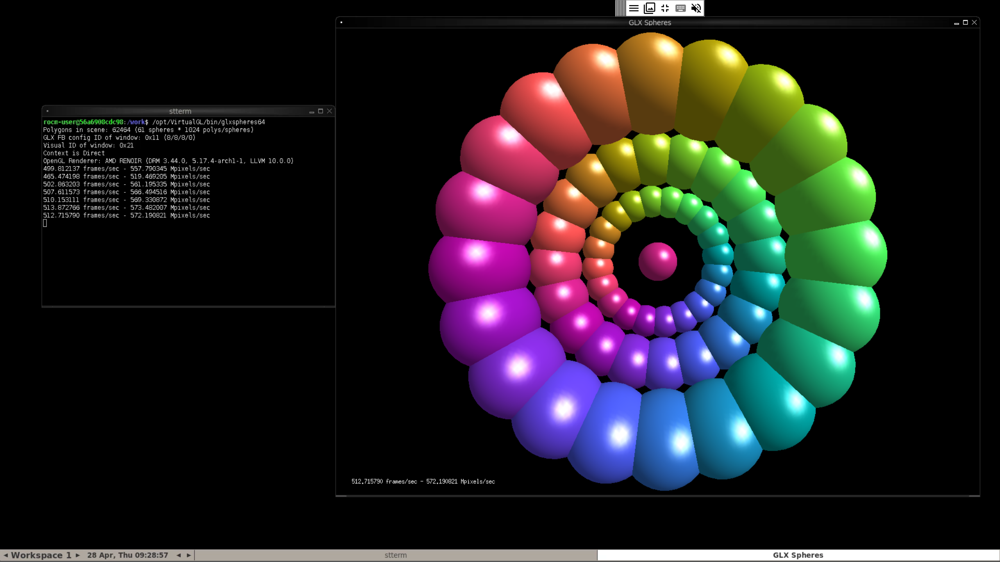

# Xpra with AMD GPUs

## Requirements

- AMD GPU
- podman (rootless)
- buildah

## build

```bash
$ buildah bud -t xpra_with_gpu .
```

## run

```bash
$ podman run --rm -it -e XPRA_PASSWORD="yourpass" --device=/dev/dri -p 14500:14500 xpra_with_gpu
# then, open the url https://{host}:14500/ with your browser
```

- Use your cert
```bash
$ podman run --rm -it -e XPRA_PASSWORD="yourpass" --device=/dev/dri -p 14500:14500 -v $(pwd)/your-cert.pem:/work/ssl-cert.pem:ro xpra_with_gpu
```

## screenshot

- AMD Ryzen™ 7 PRO 4750G


